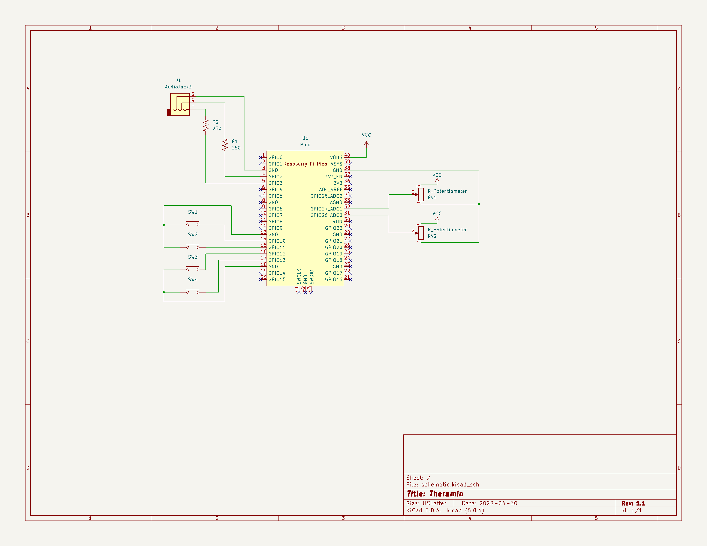

A KiCad project is included, containing the used wiring diagram, and a proposed PCB design.

## Wiring Diagram:

The Raspberry Pi Pico symbols footprints were sourced from [this repo](https://github.com/ncarandini/KiCad-RP-Pico/).  No modifications were made.

License [here](https://github.com/ncarandini/KiCad-RP-Pico/blob/dc6f9b9f213dc36eebce626aa9ee72a333fa0db3/LICENSE)
