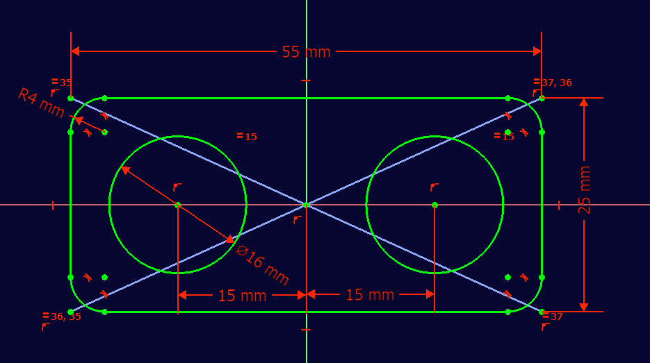
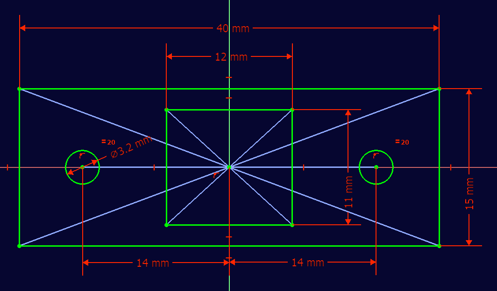

There are currently only files to support building the theramin inside of a cardboard box.  We plan to design a fully 3d printed enclosure in the future.

## Cardboard Enclosure
For prototyping, we have created an enclosure using an adafruit box.  3d printed brackets were used to help secure the buttons and usb panel mount.

### Button Panel Sketch

### USB B Panel Mount Support Sketch

