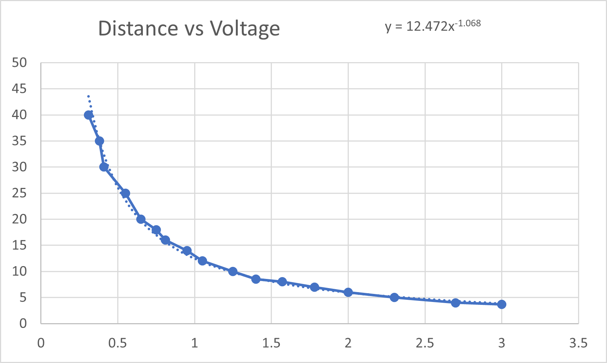
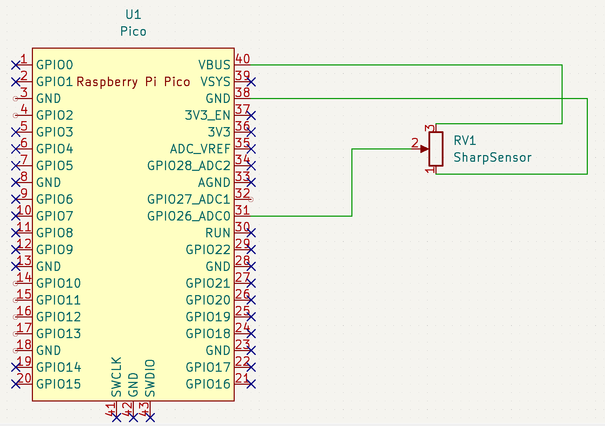

## Sensor Test
As a step towards building the complete project we first tested the implementation of data collection from one sensor.  This allowed us to verify that we were getting the values we expected, and gave us a chance to refine our data manipulation.  Some of what we learned is detailed at the bottom of this document.

### Voltage Calibration
From the RP2040 datasheet, the board has a 12 bit ADC, with a maximum voltage of 3.3v.  To convert the 12 bit unsigned ADC value to voltage, we can use `3.3 * adc / 1 << 12`

### Sensor Calibration
From the datasheet of the distance sensor used, I used excel to create a scatterplot of the data given.  I then used the trendline function to generate a formula for the distance between the object and the sensor, given the voltage the ADC was reading.

The formula this generated for our sensor was: `distance = 12.472 / voltage ^ -1.068`

### BOM:
- Raspberry Pi Pico
- Sharp GP2Y0A41SK0F IR distance sensor

### Wiring Diagram:

#### Learning points
We discovered issues in the upload process using Arduino IDE 1.8.16, which we resolved by using a more recent version of the IDE, 2.0.0 rc-6.

We also learned that some of our assumptions about the functionality of analogRead were incorrect.  We had believed that analogRead would return an integer with the full resolution of the RP2040 adc, but instead found that the return values only ranged from 0 to 1024.  I found that for compatibility, arduino defaults to 10bit adc.  We found the solution to our issue in the arduino documentation of analogRead(), which explained we could use analogReadResolution() to set the resolution to the RP2040 ADC resolution of 12 bits.
